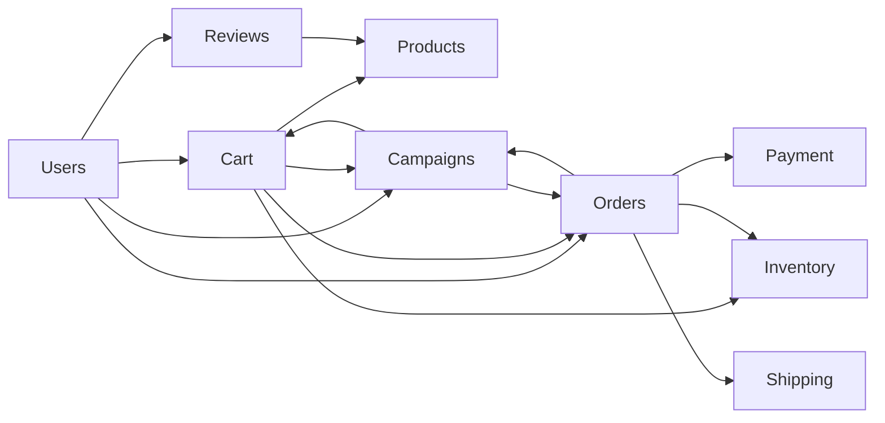
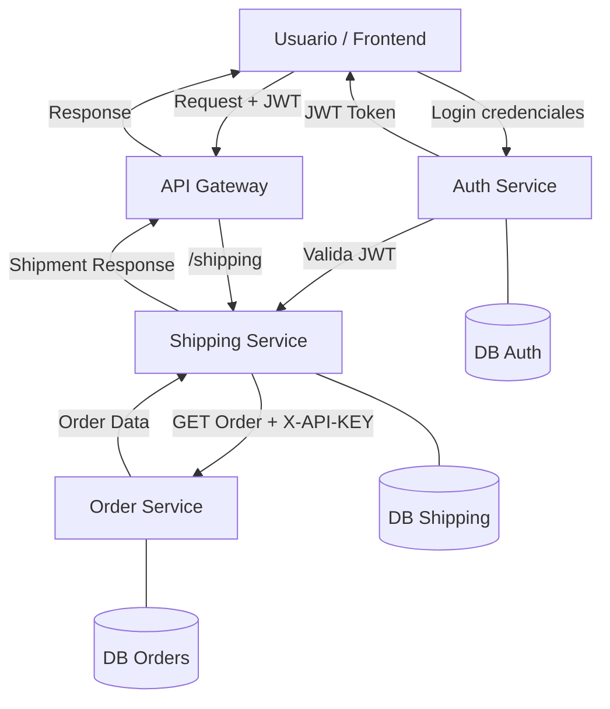
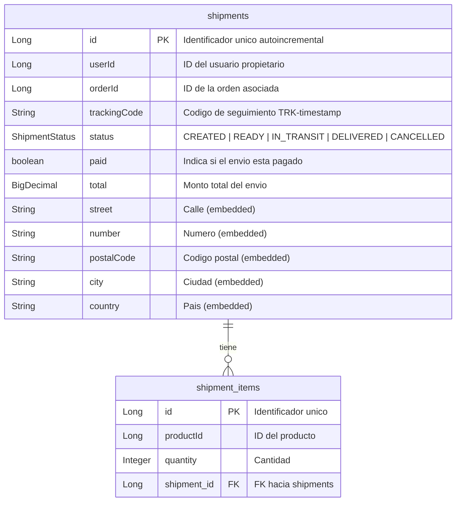

# Proyecto de Microservicios para E-commerce

## Descripcion General

Plataforma de comercio electronico basada en una arquitectura de microservicios con Java 21 y Spring Boot. El sistema esta compuesto por 9 microservicios independientes, cada uno con su propia base de datos, logica de negocio y documentacion OpenAPI.

---

## Definicion de requerimientos por microservicio

| # | Microservicio | Responsabilidad principal | Desafio academico |
|---|---|---|---|
| 1 | Users (Identity) | Registro, login, Roles (JWT). | Seguridad y RBAC. |
| 2 | Products (Catalog) | Gestion de catalogo, categorias, imagenes. | Consultas rapidas / Cache. |
| 3 | Inventory (Stock) | Existencias fisicas, entradas y salidas. | Consistencia de datos. |
| 4 | Cart (Basket) | Carrito temporal (Redis o memoria). | Manejo de sesiones / TTL. |
| 5 | Orders (Sales) | Orquestacion de la venta y estados del pedido. | Maquina de estados. |
| 6 | Payment (Finance) | Integracion (simulada) con pasarelas. | Transaccionalidad y Reintentos. |
| 7 | **Shipping (Logistics)** | Envios, seguimiento y logistica. Seguridad JWT + API Key. Dockerizado. | Comunicacion segura entre MS. |
| 8 | Reviews (Social) | Valoraciones y comentarios de productos. | Gestion de contenido / Moderacion. |
| 9 | Campaigns (Marketing) | Cupones de descuento y promociones. | Logica de reglas de negocio. |

---

## Arquitectura del sistema

### Interaccion entre microservicios



### Arquitectura de seguridad - Shipping Service



---

## Stack tecnologico

| Componente | Tecnologia |
|-----------|------------|
| Lenguaje | Java 21 |
| Framework | Spring Boot 3.2.5 / 4.0.3 |
| ORM | Spring Data JPA / Hibernate |
| Base de datos | PostgreSQL |
| Seguridad | Spring Security + JWT (jjwt 0.11.5) |
| Cliente HTTP | OpenFeign / Spring WebClient |
| Documentacion | SpringDoc OpenAPI (Swagger UI) |
| Build | Maven |
| Contenedores | Docker (multi-stage build) |
| Codigo auxiliar | Lombok |

---

## Puertos por microservicio

| # | Microservicio | Puerto | Estado |
|---|---|---|---|
| 1 | Users (Identity) | 8081 | Operativo |
| 2 | Products (Catalog) | 8082 | Operativo |
| 3 | Inventory (Stock) | 8083 | Operativo |
| 4 | Cart (Basket) | 8084 | Operativo |
| 5 | Orders (Sales) | 8085 | Operativo |
| 6 | Payment (Finance) | 8086 | Operativo |
| 7 | **Shipping (Logistics)** | **8087** | **Operativo + Seguridad + Docker** |
| 8 | Reviews (Social) | 8088 | Operativo |
| 9 | Campaigns (Marketing) | 8089 | Operativo |

---

## Documentacion OpenAPI y Swagger

| # | Microservicio | OpenAPI JSON | Swagger UI |
|---|---|---|---|
| 1 | Users | `http://localhost:8081/users/openapi` | `http://localhost:8081/users/docs` |
| 2 | Products | `http://localhost:8082/products/openapi` | `http://localhost:8082/products/docs` |
| 3 | Inventory | `http://localhost:8083/inventory/openapi` | `http://localhost:8083/inventory/docs` |
| 4 | Cart | `http://localhost:8084/cart/openapi` | `http://localhost:8084/cart/docs` |
| 5 | Orders | `http://localhost:8085/orders/openapi` | `http://localhost:8085/orders/docs` |
| 6 | Payment | `http://localhost:8086/payment/openapi` | `http://localhost:8086/payment/docs` |
| 7 | **Shipping** | `http://localhost:8087/v3/api-docs` | `http://localhost:8087/swagger-ui/index.html` |
| 8 | Reviews | `http://localhost:8088/reviews/openapi` | `http://localhost:8088/reviews/docs` |
| 9 | Campaigns | `http://localhost:8089/campaigns/openapi` | `http://localhost:8089/campaigns/docs` |

---

## Microservicio de Shipping (Detalle)

### Estructura del proyecto

```
shipping/
├── src/main/java/dev/rampmaster/ecommerce/shipping/
│   ├── ShippingApplication.java
│   ├── client/
│   │   └── OrderClient.java              # Cliente HTTP hacia Order Service
│   ├── config/
│   │   ├── OpenApiConfig.java             # Configuracion Swagger
│   │   └── WebClientConfig.java           # Bean WebClient
│   ├── controller/
│   │   └── ShipmentController.java        # Endpoints REST
│   ├── dto/
│   │   ├── AddressResponse.java
│   │   ├── CreateShipmentRequest.java
│   │   ├── OrderItemResponse.java
│   │   └── OrderResponse.java
│   ├── model/
│   │   ├── Shipment.java                  # Entidad principal
│   │   ├── ShipmentAddressSnapshot.java   # Direccion embebida
│   │   ├── ShipmentItem.java              # Items del envio
│   │   └── ShipmentStatus.java            # Enum de estados
│   ├── repository/
│   │   └── ShipmentRepository.java
│   ├── security/
│   │   ├── JwtAuthenticationFilter.java   # Filtro JWT para usuarios
│   │   ├── ApiKeyAuthenticationFilter.java # Filtro API Key para MS
│   │   └── SecurityConfig.java            # Configuracion Spring Security
│   └── service/
│       └── ShipmentService.java           # Logica de negocio
├── src/main/resources/
│   └── application.properties
├── Dockerfile
├── docker-compose.yaml
├── .env
└── pom.xml
```

### Modelo de datos



### Endpoints REST

| Metodo | Endpoint | Descripcion | Auth requerida |
|--------|----------|-------------|----------------|
| GET | `/api/shipments` | Listar todos los envios | JWT o API Key |
| GET | `/api/shipments/{id}` | Obtener envio por ID | JWT o API Key |
| POST | `/api/shipments/from-order/{orderId}` | Crear envio desde una orden | JWT o API Key |
| PUT | `/api/shipments/{id}` | Actualizar envio | JWT o API Key |
| DELETE | `/api/shipments/{id}` | Eliminar envio | JWT o API Key |

#### Ejemplo: Crear envio desde orden

**Request:**

```bash
curl -X POST \
  -H "X-API-KEY: <api_key>" \
  -H "Content-Type: application/json" \
  -d '{
    "street": "Av. Providencia",
    "number": "1234",
    "city": "Santiago",
    "postalCode": "7500000",
    "country": "Chile"
  }' \
  http://localhost:8087/api/shipments/from-order/1
```

**Response (200):**

```json
{
  "id": 1,
  "userId": 10,
  "orderId": 1,
  "trackingCode": "TRK-1711382400000",
  "status": "CREATED",
  "paid": true,
  "total": 25000,
  "address": {
    "street": "Av. Providencia",
    "number": "1234",
    "postalCode": "7500000",
    "city": "Santiago",
    "country": "Chile"
  },
  "items": [
    {
      "id": 1,
      "productId": 3,
      "quantity": 2
    }
  ]
}
```

#### Ejemplo: Listar envios

```bash
curl -H "Authorization: Bearer <token_jwt>" http://localhost:8087/api/shipments
```

#### Ejemplo: Actualizar envio

```bash
curl -X PUT \
  -H "X-API-KEY: <api_key>" \
  -H "Content-Type: application/json" \
  -d '{
    "userId": 1,
    "orderId": 1,
    "paid": true,
    "status": "IN_TRANSIT",
    "total": 25000,
    "address": {
      "street": "Av. Providencia",
      "number": "1234",
      "city": "Santiago",
      "postalCode": "7500000",
      "country": "Chile"
    }
  }' \
  http://localhost:8087/api/shipments/1
```

---

## Seguridad

### Autenticacion en dos niveles

El microservicio de Shipping implementa seguridad en dos niveles, protegiendo tanto el acceso de usuarios como la comunicacion entre microservicios.

#### Nivel 1: JWT (usuarios)

El usuario se autentica en el Auth Service, obtiene un JWT y lo envia en cada request.

```
Authorization: Bearer <token_jwt>
```

- Validacion local de firma HMAC-SHA256
- Extraccion de `subject` (usuario) y `role` del token
- Modelo stateless sin sesiones en servidor

#### Nivel 2: API Key (microservicios)

Los microservicios se autentican entre si mediante una API Key estatica.

```
X-API-KEY: <api_key>
```

- Solo actua si no hay autenticacion JWT previa
- Asigna rol `ROLE_SERVICE` al cliente autenticado
- El `OrderClient` envia automaticamente la API Key al consultar Orders

#### Cadena de filtros

```
Request → JwtAuthenticationFilter → ApiKeyAuthenticationFilter → Controller
```

#### Endpoints publicos (sin auth)

| Ruta | Descripcion |
|------|-------------|
| `/swagger-ui/**` | Swagger UI |
| `/v3/api-docs/**` | OpenAPI JSON |

#### Respuestas de seguridad

| Escenario | HTTP |
|-----------|------|
| Sin credenciales | `403` |
| JWT invalido | `403` |
| API Key invalida | `403` |
| JWT valido | `200` |
| API Key valida | `200` |
| Swagger (publico) | `200` |

---

## Contenerizacion con Docker

### Dockerfile (multi-stage)

```dockerfile
# Etapa 1: Build
FROM maven:3.9.6-eclipse-temurin-21 AS builder
WORKDIR /app
COPY pom.xml .
COPY .mvn .mvn
COPY mvnw .
RUN chmod +x mvnw
RUN ./mvnw dependency:go-offline
COPY src src
RUN ./mvnw clean package -DskipTests

# Etapa 2: Runtime
FROM eclipse-temurin:21-jre
WORKDIR /app
COPY --from=builder /app/target/*.jar app.jar
EXPOSE 8087
ENTRYPOINT ["java", "-jar", "app.jar"]
```

### Docker Compose

```yaml
services:
  shipping-service:
    build:
      context: .
      dockerfile: Dockerfile
    container_name: shipping-service
    ports:
      - "${SERVER_PORT:-8087}:8087"
    env_file:
      - .env
    restart: unless-stopped
```

### Variables de entorno

| Variable | Descripcion |
|----------|-------------|
| `SERVER_PORT` | Puerto del servidor (8087) |
| `APP_NAME` | Nombre de la aplicacion |
| `DB_URL` | URL de conexion a PostgreSQL |
| `DB_USERNAME` | Usuario de base de datos |
| `DB_PASSWORD` | Contrasena de base de datos |
| `JWT_SECRET` | Secret para validacion JWT |
| `API_KEY` | API Key para comunicacion M2M |

### Comandos de despliegue

```bash
# Construir imagen
docker compose build

# Levantar contenedor
docker compose up -d

# Ver logs
docker logs shipping-service

# Detener
docker compose down
```

---

## Exposicion publica

El microservicio de Shipping esta desplegado y expuesto publicamente para que las demas celulas del proyecto puedan consumir sus endpoints.

| Recurso | URL |
|---------|-----|
| **API Base** | `http://levelup.ddns.net:8087` |
| **Swagger UI** | `http://levelup.ddns.net:8087/swagger-ui/index.html` |
| **OpenAPI JSON** | `http://levelup.ddns.net:8087/v3/api-docs` |

### Consumo desde otros microservicios

```bash
curl -H "X-API-KEY: <api_key>" http://levelup.ddns.net:8087/api/shipments
```

### Consumo desde frontend

```bash
curl -H "Authorization: Bearer <token_jwt>" http://levelup.ddns.net:8087/api/shipments
```

---

## Endpoints base (CRUD) - Todos los microservicios

| # | Microservicio | Endpoint GET (listar) |
|---|---|---|
| 1 | Users | `http://localhost:8081/users/api/users` |
| 2 | Products | `http://localhost:8082/products/api/products` |
| 3 | Inventory | `http://localhost:8083/inventory/api/inventories` |
| 4 | Cart | `http://localhost:8084/cart/api/carts` |
| 5 | Orders | `http://localhost:8085/orders/api/orders` |
| 6 | Payment | `http://localhost:8086/payment/api/payments` |
| 7 | **Shipping** | `http://localhost:8087/api/shipments` |
| 8 | Reviews | `http://localhost:8088/reviews/api/reviews` |
| 9 | Campaigns | `http://localhost:8089/campaigns/api/campaigns` |

---

## Ejemplos de consumo

### Ejemplos con curl

```bash
curl -s http://localhost:8081/users/api/users
curl -s http://localhost:8082/products/api/products
curl -s http://localhost:8083/inventory/api/inventories
curl -s -H "X-API-KEY: <api_key>" http://localhost:8087/api/shipments
```

### Respuestas esperadas (data semilla)

`GET /users/api/users`

```json
[
  {
    "id": 1,
    "username": "admin",
    "email": "admin@ecommerce.dev",
    "role": "ADMIN",
    "active": true
  },
  {
    "id": 2,
    "username": "buyer01",
    "email": "buyer01@ecommerce.dev",
    "role": "CUSTOMER",
    "active": true
  }
]
```

`GET /products/api/products`

```json
[
  {
    "id": 1,
    "name": "Laptop Pro 14",
    "category": "Computing",
    "price": 1499.99,
    "active": true
  },
  {
    "id": 2,
    "name": "Auriculares Wireless",
    "category": "Audio",
    "price": 129.90,
    "active": true
  }
]
```

`GET /inventory/api/inventories`

```json
[
  {
    "id": 1,
    "productId": 1,
    "quantity": 25,
    "warehouseCode": "WH-BOG-01"
  },
  {
    "id": 2,
    "productId": 2,
    "quantity": 80,
    "warehouseCode": "WH-MDE-01"
  }
]
```

`GET /api/shipments` (requiere autenticacion)

```json
[
  {
    "id": 1,
    "userId": 10,
    "orderId": 5,
    "trackingCode": "TRK-1711382400000",
    "status": "CREATED",
    "paid": true,
    "total": 25000,
    "address": {
      "street": "Av. Providencia",
      "number": "1234",
      "postalCode": "7500000",
      "city": "Santiago",
      "country": "Chile"
    },
    "items": [
      {
        "id": 1,
        "productId": 3,
        "quantity": 2
      }
    ]
  }
]
```
---
